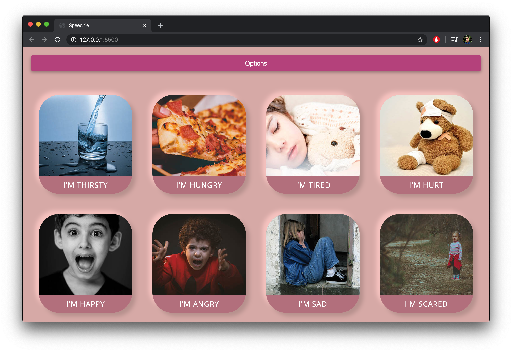
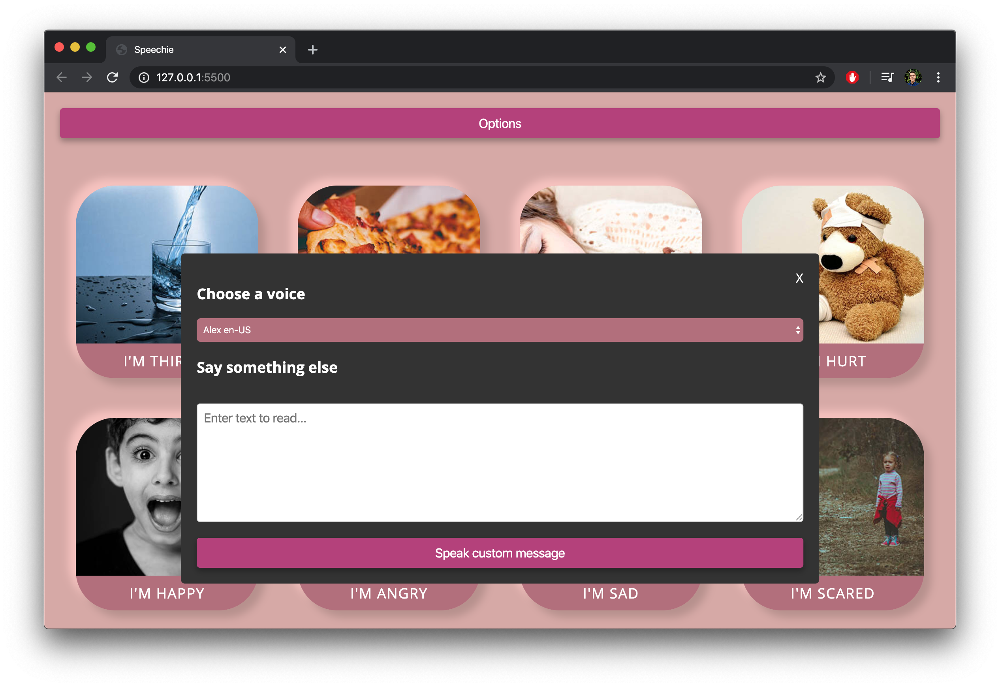

# SPEECHIE
> A speaking app with speech synthesis using the [Web Speech API](https://developer.mozilla.org/en-US/docs/Web/API/Web_Speech_API) desgined for children on the spectrum

## About
### Use
Run index.html in a browser.
Try it - [Typing Game](https://mrivasperez.github.io/speechie/)

## Information
### Author
[Miguel Rivas Perez](https://github.com/mrivasperez)
### Acknowledgements
- Brad Travery for the code along.
### License

> This project is licensed under the [Unlicense](https://github.com/mrivasperez/neumorphic-typing-game/blob/master/LICENSE)

## Screenshots

> The main page with preconfigured speech options and images.

> A screen shot of the options modal where user can type custom text and select different voices.